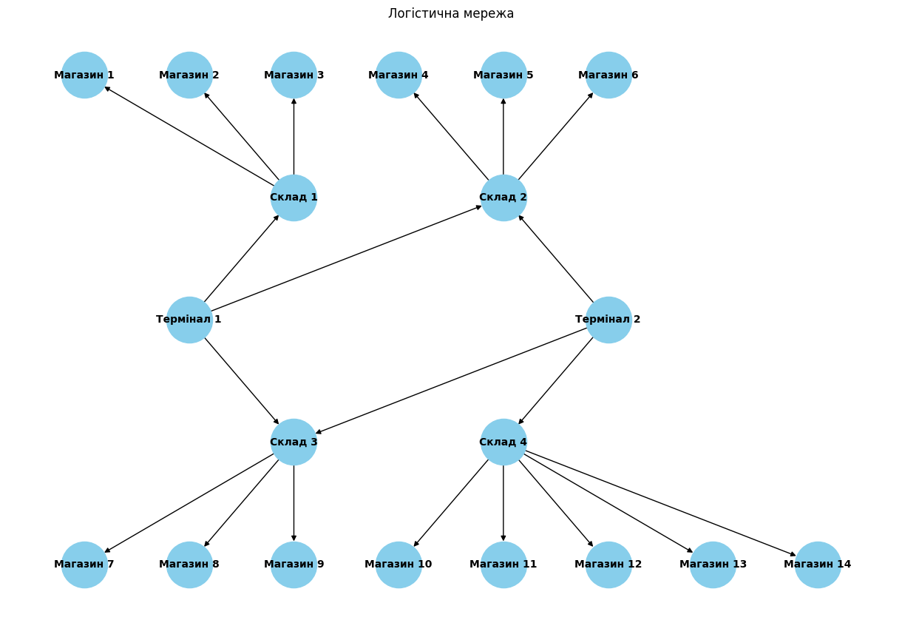

# Завдання 1. Застосування алгоритму макс

## Опис завдання

### Побудуйте модель графа, що представляє мережу потоків у наступному зображені:

Зв'язки та пропускні здатності у графі мають наступний вигляд:

| Від        | До         | Пропускна здатність (одиниць) |
| ---------- | ---------- | ----------------------------- |
| Термінал 1 | Склад 1    | 25                            |
| Термінал 1 | Склад 2    | 20                            |
| Термінал 1 | Склад 3    | 15                            |
| Термінал 2 | Склад 3    | 15                            |
| Термінал 2 | Склад 4    | 30                            |
| Термінал 2 | Склад 2    | 10                            |
| Склад 1    | Магазин 1  | 15                            |
| Склад 1    | Магазин 2  | 10                            |
| Склад 1    | Магазин 3  | 20                            |
| Склад 2    | Магазин 4  | 15                            |
| Склад 2    | Магазин 5  | 10                            |
| Склад 2    | Магазин 6  | 25                            |
| Склад 3    | Магазин 7  | 20                            |
| Склад 3    | Магазин 8  | 15                            |
| Склад 3    | Магазин 9  | 10                            |
| Склад 4    | Магазин 10 | 20                            |
| Склад 4    | Магазин 11 | 10                            |
| Склад 4    | Магазин 12 | 15                            |
| Склад 4    | Магазин 13 | 5                             |
| Склад 4    | Магазин 14 | 10                            |

Застосуйте алгоритм максимального потоку для вирішення задачі. Напишіть програму, що реалізує алгоритм Едмондса-Карпа, або скористайтеся вже реалізованою версією для знаходження максимального потоку в побудованому графі. Проведіть аналіз отриманого результату. Чи досягнуто оптимального потоку, і що це означає для розглянутої мережі?

Оформіть звіт з розрахунками та поясненнями. Поясніть, які вершини та ребра було вибрано, як вони відповідають реальним елементам логістичної системи. Покажіть покроковий розрахунок максимального потоку та пояснити логіку кожного кроку.

## Технічні умови

1. Використовуйте алгоритм Едмондса-Карпа для реалізації максимального потоку.

2. Побудова графа повинна відповідати наведеній структурі з 20 вершинами та заданими пропускними здатностями.

Критерії прийняття

📌Критерії прийняття домашнього завдання є обов’язковою умовою розгляду домашнього завдання ментором. Якщо якийсь з критеріїв не виконано, ДЗ відправляється ментором на доопрацювання без оцінювання. Якщо вам «тільки уточнити»😉 або ви «застопорилися» на якомусь з етапів виконання — звертайтеся до ментора у Slack).

1. Програма коректно виконує розрахунок максимального потоку та повертає точні результати (15 б.).

2. Дані коректно додаються до графа та відповідають наведеній структурі логістичної мережі (15 б.).

3. Пояснення та аналіз зрозумілі та чітко відображають логіку роботи алгоритму (10 б.).

4. Звіт включає аналіз отриманих результатів (10 б.).

Звіт з розрахунками та поясненнями повинен включати таблицю з результатами потоків між терміналами та магазинами наступного вигляду:

| Термінал   | Магазин    | Фактичний Потік (одиниць) |
| ---------- | ---------- | ------------------------- |
| Термінал 1 | Магазин 1  | X                         |
| Термінал 1 | Магазин 2  | Y                         |
| …          | …          | …                         |
| Термінал 2 | Магазин 14 | Z                         |

У таблиці наведено підсумкові значення потоків між терміналами та магазинами, що були обчислені за допомогою алгоритму Едмондса-Карпа. Дані для кожного термінала і магазину відображають обсяг товару, який фактично було доставлено.

Після отримання таблиці дайте відповідь на наступні запитання:

1. Які термінали забезпечують найбільший потік товарів до магазинів?

2. Які маршрути мають найменшу пропускну здатність і як це впливає на загальний потік?

3. Які магазини отримали найменше товарів і чи можна збільшити їх постачання, збільшивши пропускну здатність певних маршрутів?

4. Чи є вузькі місця, які можна усунути для покращення ефективності логістичної мережі?

# Завдання 2. Розширення функціоналу префіксного дерева

Реалізуйте два додаткових методи для класу Trie:

- `count_words_with_suffix(pattern)` для підрахунку кількості слів, що закінчуються заданим шаблоном
- `has_prefix(prefix)` для перевірки наявності слів із заданим префіксом

## Технічні умови

- Клас `Homework` має успадковувати базовий клас `Trie`
- Методи повинні опрацьовувати помилки введення некоректних даних
- Вхідні параметри обох методів мають бути рядками
- Метод `count_words_with_suffix` має повертати ціле число
- Метод `has_prefix` має повертати булеве значення

Критерії прийняття

📌Критерії прийняття домашнього завдання є обов’язковою умовою розгляду завдання ментором. Якщо якийсь із критеріїв не виконано, ментор надішле ДЗ на доопрацювання без оцінювання. Якщо вам «тільки уточнити»😉 або ви застопорилися на якомусь з етапів виконання — звертайтеся до ментора у Slack).

1. Метод count_words_with_suffix повертає кількість слів, що закінчуються на заданий pattern. За відсутності слів повертає 0. Враховує регістр символів (10 б).

2. Метод has_prefix повертає True, якщо існує хоча б одне слово із заданим префіксом. Повертає False, якщо таких слів немає. Враховує регістр символів (10 б).

3. Код проходить усі тести (10 б).

4. Обробляються некоректні вхідні дані (10 б).

5. Методи працюють ефективно на великих наборах даних (10 б).
